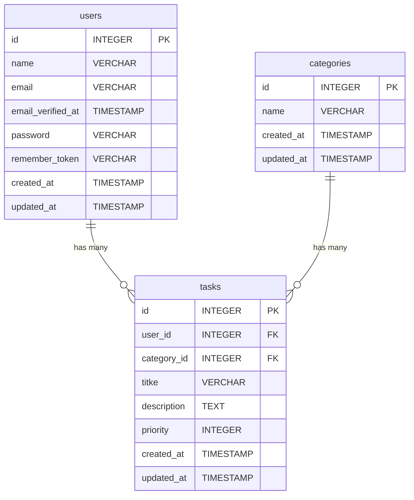

# COACHTECH タスク管理アプリ

タスクの作成、編集と削除ができます。
タスクのカテゴリー分けと優先度も設定することができます。

## 作成者

赤池美優

## 使用技術

- **言語**: PHP 8.4.1
- **フレームワーク**: Laravel Framework 10.50.2
- **データベース**: MySQL 8.4.10
- **フロントエンド**: Tailwinid CSS 3.4.19
- **ビルドツール**: Vite 5.4.21
- **開発環境**: Doocker Sail
- **バージョン管理**: Git 2.43.0
- **テストツール**: Postman for Windows 12.20.1

## ER図



## 開発環境URL

http://localhost

## 動作環境

Windows11上のWSL(Ubuntu)で開発しています。
また、Docker上でPHP、Laravel、MySQLを使用して動作しています。

## 環境構築手順

1. **リポジトリをクローン**

    ```
    git clone https://github.com/miyori-knzk/task-manager2.git
    ```

2. **.envファイルの準備**

    プロジェクトフォルダに移動し、
    .env.exsampleをコピーして.envを作成

    ```
    cd task-manager2
    cp .env.example .env
    ```

    .envファイルを開き、データベース情報が以下のようになっているか確認

    ```
    DB_CONNECTION=mysql
    DB_HOST=mysql
    DB_PORT=3306
    DB_DATABASE=laravel
    DB_USERNAME=sail
    DB_PASSWORD=password
    ```

3. **Composer依存パッケージのインストール**

    ```
    docker run --rm
    -u "$(id -u):$(id -g)"
    -v "$(pwd):/var/www/html"
    -w /var/www/html
    -e COMPOSER_CACHE_DIR=/tmp/composer_cache
    laravelsail/php82-composer:latest
    composer install --ignore-platform-reqs
    ```

4. **Laravel Sailの起動**

    ```
    ./vendor/bin/sail up -d
    ```

5. **NPM依存パッケージのインストール**

    ```
    sail npm install
    ```

6. **アプリケーションキーの生成**

    ```
    ./vendor/bin/sail artisan key:generate
    ```

7. **データベースのマイグレーションと初期データ投入**

    マイグレーションの実行

    ```
    ./vendor/bin/sail artisan migrate
    ```

    初期データ投入

    ```
    ./vendor/bin/sail artisan db:seed
    ```

8. **フロントエンドのビルド**

    ```
    ./vendor/bin/sail npm run build
    ```

9. **アプリケーションへのアクセス**
    - ブラウザで<http://localhost>にアクセスしログインページが表示されるか確認し、テストユーザーでログインする  
      メールアドレス：test@test  
      パスワード：password
    - ブラウザで<http://localhost:8080>にアクセスしphpMyAdminが表示されるか確認

## テスト実行

```
./vendor/bin/sail test
```

## 機能一覧

- ユーザー(新規ユーザー登録、ログイン、ログアウト)
- カテゴリー(カテゴリー作成、編集、削除)
- タスク(タスク作成、編集)

## APIエンドポイント一覧

| HTTPメソッド | URI               | 概要                     |
| ------------ | ----------------- | ------------------------ |
| GET          | /api/tasks        | タスク一覧をjsonで取得   |
| GET          | /api/tasks/{task} | 特定のタスクをjsonで取得 |
